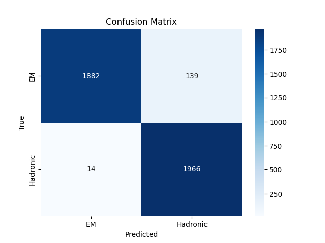
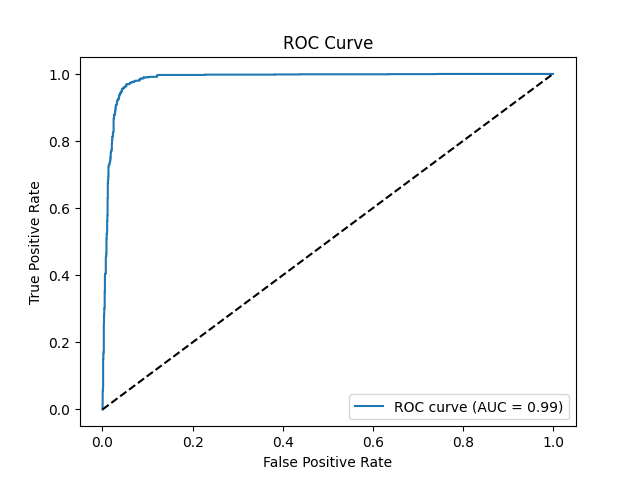
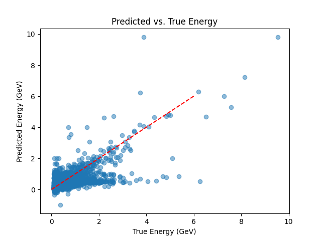

# Calorimeter Energy Clustering and Particle Prediction

This project develops a convolutional neural network (CNN) to:
1. Cluster energy deposits in a calorimeter.
2. Classify the type of particle based on the energy cluster.
3. Predict the true particle energy.

The project uses a C++ script to prepare the dataset and a Python script with TensorFlow for training the CNN.

## Table of Contents
- [Installation](#installation)
- [Usage](#usage)
- [Project Structure](#project-structure)
- [Results](#results)

## Installation

### Prerequisites
- **C++**: Requires `root clang` and standard c++ libraries.
- **Python**: Python 3.8+ with the following packages:

Install Python dependencies:
```bash
pip install -r requirements.txt
```

## Usage

1. **Prepare the Dataset**:
   Compile and run the C++ script:
   ```bash
   g++ src/prepare_dataset.cpp -o prepare_dataset
   ./prepare_dataset
   ```
   This generates the dataset in `dataset/`.

2. **Train the Neural Network**:
   Run the Python script:
   ```bash
   python src/train_model.py
   ```
   Outputs include trained models in `models/` (ignored by git) and results in `images/`.

## Project Structure

```
ML_model_for_calorimeter_event_handling/
├── dataset/              # Sample dataset or data preparation outputs
├── models/               # Trained neural network models
├── results/              # Graphic results
├── scripts/              # Source code
│   ├── prepare_dataset_from_root_file.cpp
│   └── main.py
├── requirements.txt      # Python dependencies
└── README.md             # Project documentation
```

## Results

### Classification
Particle type classification achieves an accuracy of 96,8%.

Confusion matrix for 4k events:



ROC curve for classificator:



### Energy Prediction
Mean Squared Error (MAE) for true energy prediction: 0.281.



It is easy to see that in the phase space of predicted and true energies, 
the data is clustered in two series. The explanation for this fact is 
extremely simple: both hadrons and photons with electrons release almost 
all of their energy in the calorimeter at low energies, but as the energies 
increase, hadrons begin to release a significantly lower proportion of energy 
on average. Based on this conclusion, it is possible to modernize the 
architecture of the regression part of the model to take into account the 
type of particle (output of the classifier layer) for the regression task.
